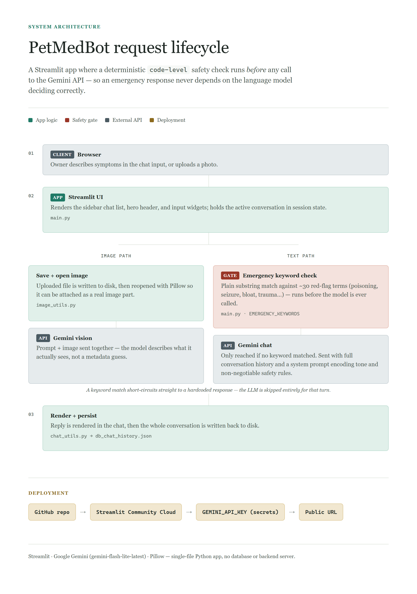

# 🐾 PetMedBot

An AI veterinary assistant built with Streamlit and Google's Gemini API. Describe your pet's symptoms (or upload a photo) and get grounded, vet-tech-style guidance — with hard safety rules for actual emergencies.

**Live demo:** _add your Streamlit Cloud URL here once deployed_

## Features

- Conversational symptom triage with full chat history, powered by Gemini
- Real image analysis for photos of visible symptoms (skin issues, swelling, wounds, etc.)
- Code-level emergency detection — poisoning, seizures, bloat, trauma, and similar red-flag keywords trigger an immediate "go to the vet now" response, independent of the LLM
- Persistent multi-chat history (sidebar, like a typical chat app)
- Never suggests medication dosages — always defers to a licensed vet

## Architecture



The emergency keyword check runs as plain code, before the Gemini API is ever called — so a safety response never depends on the model getting it right.

## Tech stack

- [Streamlit](https://streamlit.io/) — UI
- [Gemini API](https://ai.google.dev/) (`gemini-flash-lite-latest`) — chat + vision
- Pillow — image handling

## Running locally

```bash
git clone https://github.com/askarbekkk/petmedbot__LLM.git
cd petmedbot__LLM
python -m venv venv
venv\Scripts\activate       # Windows
pip install -r requirements.txt
```

Create a `.env` file in the project root with your free Gemini API key ([get one here](https://aistudio.google.com/apikey)):

```
GEMINI_API_KEY=your-key-here
```

Then run:

```bash
streamlit run main.py
```

## Deploying

Deployed on [Streamlit Community Cloud](https://share.streamlit.io) — set `GEMINI_API_KEY` under the app's Secrets instead of using a `.env` file.

## Disclaimer

PetMedBot is an AI assistant, not a substitute for a licensed veterinarian. For emergencies, always contact a vet immediately.
